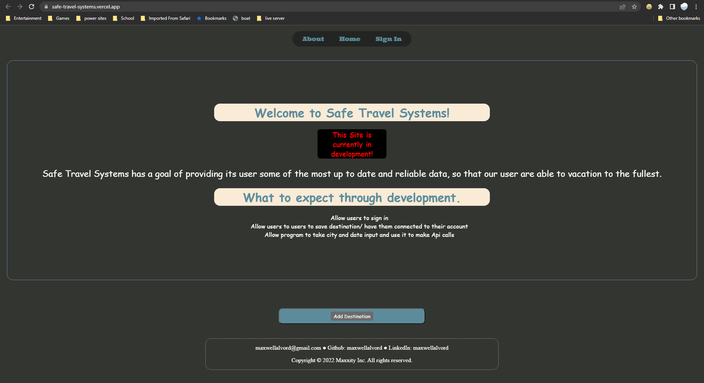

# Safe Travel Systems

## by Maxwell Alvord

### This is a webpage in development with the end goal of having a one stop shop for all information regarding safe vacationing  

## Technologies Used

            
 
          
### Description
This is a passion project that is currently in development as a project to put my NEXT.js skills to use. Safe Travel Systems aims to provide a Friendly UI and database to allow users to search and save information for their travels that might prove useful. The application of NEXT.js allows for an effecient framework of "pages" that are dynamically rendered. The ultimate goal was to use Vercel (NEXT.js deployment tool) to deploy the site stress free. 

## Live Site
* Bypass all setup and installation by visiting the live site at <a href='https://safe-travel-systems.vercel.app/'>Safe-Travel-Systems</a> (https://safe-travel-systems.vercel.app/)!

## Setup/Installation
* Clone this Repo : <https://github.com/maxwellalvord/Safe-Travel-Systems>
* cd into Safe-Travel-Systems

In the project directory (Safe-Travel-Systems), you can run:

### `npm run dev`

### `npm run build`

### `npm run lint`

(if you have any issues running the program try reinstalling the packages with npm install.)

## Known Bugs
* Input type textarea not rendering correctly.
* Hydration Error in Dev environment, all styling still renders correctly.
* Partial incorrect font render on live site.
* Render is squished in mobile version.

---
### Research & Planning Log
#### Friday, 09/16
* 8:30: create framework, starting steps etc
* 9:00: create trello board
* 10:00: research Next.js/Now (https://www.youtube.com/watch?v=nolv-AJkQQ0)
* 10:45: Research Next.js docs (https://nextjs.org/docs/api-reference/create-next-app)
* 11:15: Research and troubleshoot Next/Link
* 11:50: Research Travel APIs
* 1:35: troubleshoot vercel deployment
* 2:05: more Next.js research
* 2:35: Research/prac the 10 basic hooks (https://www.youtube.com/watch?v=TNhaISOUy6Q)
* 3:10: Research next auth and databases to use and how to host the database
* 3:55: Research Railway.app
* 4:30: Research Possible APIs
#### Friday, 09/23
* 9:00: Read and research Vercel documentation
* 10:00: Research Next.js layout and Start building a diagram
* 11:00: Research possible CSS Library solutions (https://tailwindcss.com/docs/utility-first) (https://animate.style/)
* 1:30: Research and test out tailwind css styles
* 2:50: Refer to previous React projects and research next.js implementation
* 4:30: Research APIs

#### Friday, 09/30
* 8:50: work on trello board and diagram
* 2:55: Review new Epicodus internship opportunity
* 3:45: Research Next.js api implementation
* 4:25: Research next.js environment variables

#### Tuesday, 10/04
* 1:40: Pivot from ideology of not following tutorials... following this for some basic functionality with a database and authorization (https://vercel.com/guides/nextjs-prisma-postgres)
* 2:15: Restart tutorial project due to unknown error with next Auth
* 3:00: troubleshooting tutorial docs (https://vercel.com/guides/nextjs-prisma-postgres)